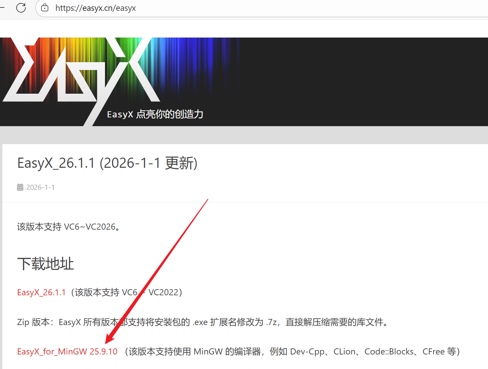
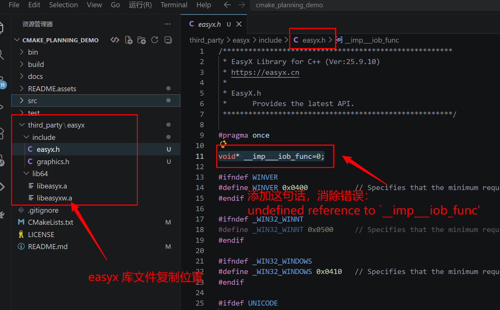

# cmake_planning_demo
cmake planning demo ：
-> src   test  third_party  docs
 src -> main.cpp
		pnc_map -> pnc_map.c pnc_map.h
		process -> process.c process.h
		
 test   测试

 third_party  安装配置

 docs  文档

# 安装三方库 easyx
到 easyx.cn 下载 for mingw（从右上角的下载进去）



复制 include lib64 文件到第三方库目录easyx

## 编译后出错

出错 ：

```
undefined reference to `__imp___iob_func'
```

## 解决方法：

在 easyx.h中添加：

```
void* __imp___iob_func=0;
```



在 调用easyx库 的代码同位置的 CMakeLists.txt中，添加 三部分 头文件路径、库路径 、库链接：

```
target_include_directories(${PROJECT_NAME}
	PUBLIC
	${CMAKE_SOURCE_DIR}/third_party/easyx/include
)   

target_link_directories(${PROJECT_NAME}
    PUBLIC
    ${CMAKE_SOURCE_DIR}/third_party/easyx/lib64
)

target_link_libraries(${PROJECT_NAME}
	PUBLIC
	easyx
)

```

# 安装三方库 Eigen

复制到 thirt_party 目录下

供 process.cpp调用