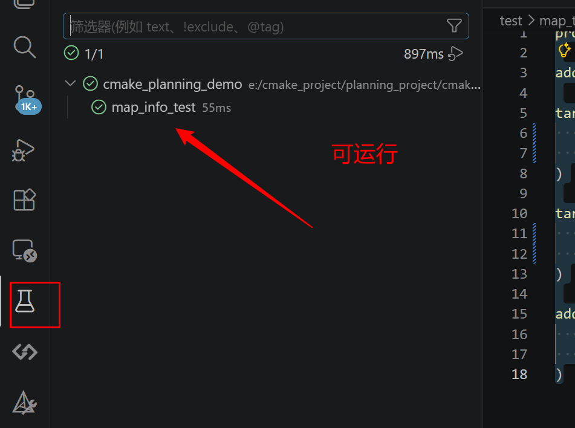

# cmake_planning_demo
cmake planning demo ：
-> src   test  third_party  docs
 src -> main.cpp
		pnc_map -> pnc_map.c pnc_map.h
		process -> process.c process.h
		
 test   测试

 third_party  安装配置

 docs  文档

# 安装三方库 easyx
到 easyx.cn 下载 for mingw（从右上角的下载进去）


复制 include lib64 文件到第三方库目录easyx

## 编译后出错

出错 ：

```
undefined reference to `__imp___iob_func'
```

## 解决方法：

在 easyx.h中添加：

```
void* __imp___iob_func=0;
```


在 调用easyx库 的代码同位置的 CMakeLists.txt中，添加 三部分 头文件路径、库路径 、库链接：

```
target_include_directories(${PROJECT_NAME}
	PUBLIC
	${CMAKE_SOURCE_DIR}/third_party/easyx/include
)   

target_link_directories(${PROJECT_NAME}
    PUBLIC
    ${CMAKE_SOURCE_DIR}/third_party/easyx/lib64
)

target_link_libraries(${PROJECT_NAME}
	PUBLIC
	easyx
)

```

# 安装三方库 Eigen

复制到 thirt_party 目录下， 在工程源目录下 cmakelists.txt 添加：

```
# 设置三方库 或者是：  set(EIGEN3_INCLUDE_DIR "C:/Program Files/eigen-3.4.0")
set(EIGEN3_INCLUDE_DIR ${CMAKE_SOURCE_DIR}/third_party/eigen-3.4.0)
list(APPEND CMAKE_MODULE_PATH "${EIGEN3_INCLUDE_DIR}/cmake") # 增加一个cmake 目录
message("CMAKE_MODULE_PATH = ${CMAKE_MODULE_PATH}")

find_package(Eigen3 3.4 REQUIRED) # 添加 cmake 文件
if(TARGET Eigen3::Eigen)
    message(STATUS "********Found Eigen3  in ${EIGEN3_INCLUDE_DIR}*******")
endif()
```

供 process.cpp调用，

在 调用 eigen 库 的代码同位置的 CMakeLists.txt中，添加 三部分 头文件路径、库路径 、库链接：


# 添加测试 

顶层  cmakelists.txt 添加：

```
enable_testing()
......
add_subdirectory(test/map_test)
```

测试文件夹 test/map_test 里的 cmakelists

```
project(map_test)

add_executable(${PROJECT_NAME} map_test.cpp)

target_include_directories(${PROJECT_NAME}
    PUBLIC
    ${Pnc_map_Dir}
)

target_link_libraries(${PROJECT_NAME}
    PUBLIC
    pnc_map
)

add_test(
    NAME map_info_test
    COMMAND ${PROJECT_NAME}
)
```

